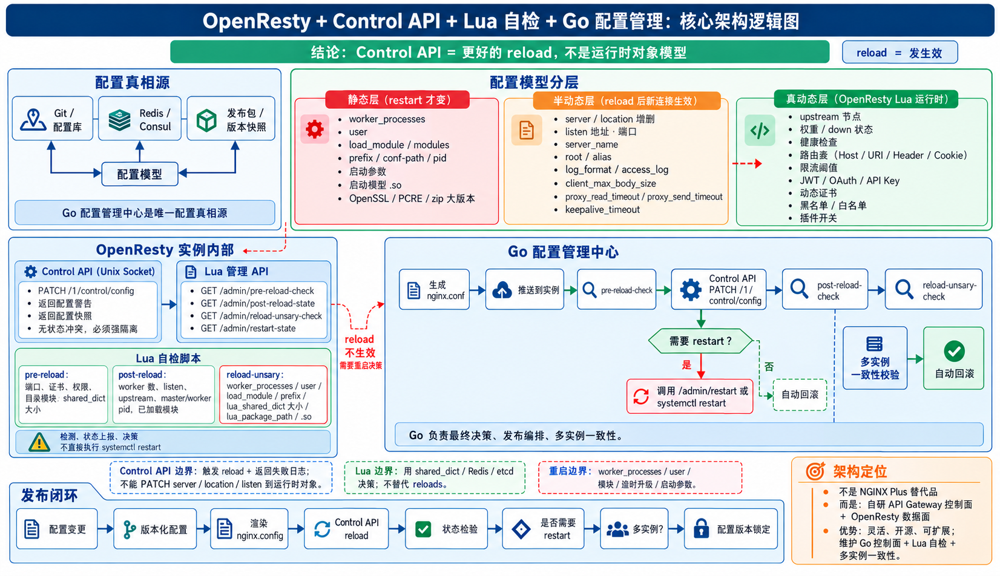

# ORP Backend — OpenResty Plus Control Plane

ORP Backend 是 OpenResty Plus 的独立 Go 控制面项目，监听地址由 `OPENRESTY_HTTP_ADDR` 配置，MySQL 结构通过 `internal/store/migrations/` 中的版本化 SQL 初始化。Redis 与 Kafka 不作为控制面数据正确性的依赖。独立运行说明见 [PROJECT.md](PROJECT.md)。

## 当前能力

- 登录、RBAC、OTP、敏感字段加密、配置资源 CRUD、审计、仪表盘与日志查询。
- MySQL 冻结发布快照、语义与文本 Diff、节点内 `nginx -t`、分批发布、回滚、节点版本核验。
- 本地 Compose 三节点使用受限 Docker 适配器；其他节点地址目前会拒绝发布。控制面启动时会核对中断任务的节点版本探针：确认已加载则登记成功，排队项中止，无法确认的项标为失败并要求重新预检；不会盲目重放。
- Upstream 渲染支持轮询、最少连接、HTTP `ip_hash`、变量 Hash、一致性 Hash、被动失败参数及 Stream 多组后端展开。OpenResty 指令以渲染结果和目标节点语法校验为准。
- 大屏 GeoIP City 数据库可在系统配置页查看和导入/替换 `.mmdb`（256 MB 上限，校验 MaxMind City 类型、摘要并记录审计），文件默认保存在 `runtime/geoip/`，可用 `OPENRESTY_GEOIP_STORAGE_DIR` 指定持久目录。无受管文件时兼容 `OPENRESTY_GEOIP_DB_PATH` 外部路径。中心可保存经纬度，地图按公网客户端 IP 绘制真实来源聚合与流线。
- 控制面大盘提供带 Bearer 鉴权的 SSE 事件流：Redis 缓存命中时立即推送快照；缓存未命中时先快速返回等待事件，由 Redis 队列后台生成并通过 SSE 推送，之后每 10 秒刷新。Redis 不可用时回退为同步生成；Filebeat 日志经 Kafka 持久化至 MySQL，本地文件作为无 Kafka 数据时的回退源。
- 实时日志接口提供 Bearer 鉴权 SSE；三个本地 Compose 节点的 Filebeat 均连接 `OPENRESTY_KAFKA_BOOTSTRAP_SERVERS`。
- 可选独立 Agent mTLS 监听器支持已登记节点的心跳、固定 reload 任务领取与结果回报；超级管理员可绑定证书 SHA-256 指纹并为在线 Agent 创建 reload 任务。它尚未连接配置发布批次，也不替代生产发布适配器。

当前能力指本地 Compose 可运行范围。可选的独立 Agent mTLS listener 提供已登记节点的心跳与手动固定 reload 任务，不等同于生产配置发布能力。Go 控制面功能盘点、验证证据和未闭环项见 [`docs/frontend-backend-migration-status.md`](docs/frontend-backend-migration-status.md)。

## 尚未闭环

- 生产节点配置制品暂存、目标节点 `nginx -t` 校验、发布批次编排、节点版本确认和故障恢复仍未接入 Agent 任务通道；当前 Agent 接口只提供节点状态心跳和独立 reload 操作。
- Agent 证书由运维侧签发并通过超级管理员接口登记指纹；尚未提供自动证书签发/轮换服务，也没有 CRL/OCSP 流程。
- 生产 Kafka 集群部署、吞吐量容量规划与 MySQL 日志归档保留策略。
- 旧 UUID Center 以外的历史资源迁移。
- Go 路由与 OpenAPI 路径检查可通过 `go run ./cmd/openapi-check` 执行。前端维护的 OpenAPI 规范校验位于独立前端项目。运行中 API 响应与完整业务 payload 的端到端契约测试仍未覆盖。
- 商业版主动健康检查、`slow_start`、节点级原生指令及需额外 NGINX 模块的功能。

## 本地开发

本地单独启动方式见 [PROJECT.md](PROJECT.md)。平台文档位于 [`docs/`](docs/)，Compose 部署与本地三节点说明见 [`deploy/README.md`](deploy/README.md)。

本地多项目联调时，将 `orp-frontend/` 和 `orp-node-agent/` 与本项目并列放在同一工作区，从 `orp-backend/` 目录运行 [`./dev.sh`](dev.sh)。脚本读取工作区根目录的 `.env`，并将运行数据放在工作区根目录的 `runtime/`。

