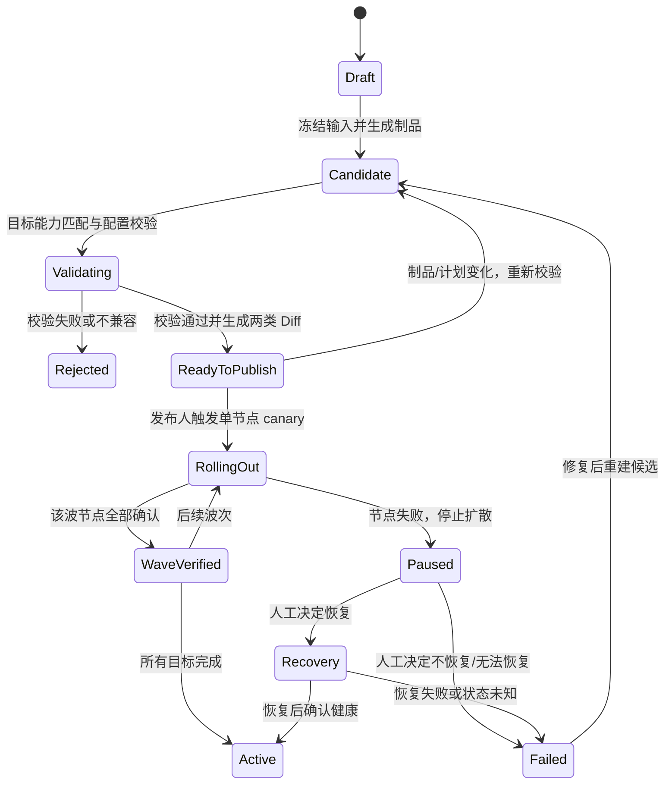

# OpenResty 配置治理新一轮需求基线

日期：2026-09-29
状态：需求基线持续确认中；已确认主要配置、审查和节点发布边界

## 产品目标

建设以 OpenResty 为数据面、MySQL 不可变配置快照为事实源的 NGINX 配置治理平台。配置需经过人工审查后发布；平台目标覆盖目标节点构建支持且平台开放的配置块与指令，并如实说明每项变更的生效方式。

## 已确认决策

1. **配置输入采用双轨模型。** 常见配置由结构化资源和表单表达；未建模的长尾指令由绑定明确配置上下文的原生指令片段表达。
2. **原生片段受平台治理。** 片段只用于开放的业务配置上下文，不得接管根配置、模块加载、include 路径、任意 Lua 执行入口或平台管理的监听骨架。未知指令需通过目标节点实际配置校验；Diff 证据标明其未知语义和生效方式声明。
3. **长期产品不设置独立人工审批门禁。** 不要求提交人与审批人分离；配置制品摘要和发布计划摘要仍须冻结并绑定发布，计划包含目标节点集合、reload/restart 动作、canary 顺序/波次、中心默认上限及健康探测。发布触发前，发布人必须确认语义 Diff、最终配置文本 Diff、目标校验结果和发布计划摘要；任一配置或计划变化都使校验与确认失效。首期候选生成/校验要求具备目标中心配置编辑权限；后续发布权限在发布阶段另行定义。
4. **审查必须同时展示两类差异。** 对象树/指令级语义 Diff 展示对象身份、上下文、指令名和前后值；最终配置文本 Diff 展示本次实际生成文件的变化。审查还需看到目标节点校验结果。
5. **能力按节点构建判定。** 节点采集运行版本、模块/编译能力及配置校验能力；候选配置的能力需求按目标节点逐个匹配。
6. **未知指令采用通用语法表示。** 通用语法树保存未知指令名、参数、上下文和嵌套块，提供指令级 Diff；目标节点 `nginx -t` 决定其构建能否接受。平台不自动猜测未知指令的影响等级或 reload/restart 语义；要显示此类解释需平台内置规则或模块适配元数据。`mail` 与第三方模块仍受目标节点实际模块/构建能力和受控上下文限制。
7. **差异保留顺序与发布物证据。** 语义 Diff 显示指令重排；最终配置文本 Diff 对确定性生成的制品展示全部变化，包括注释、空白和顺序。
8. **节点能力差异默认阻断整批。** 只有操作者显式拆分目标节点批次，并对各候选批次分别完成校验和发布计划绑定，才允许分别发布。
9. **平台支持 systemd 节点的受控 restart。** 发布计划标明 restart 影响并按节点 canary 执行；任一节点失败即停止扩散，由授权人员决定是否恢复上一健康状态。restart/恢复过程和决定均须记录审计。二进制或模块安装升级不在此决策内。直接 `./sbin/nginx` 启动且无受支持 systemd unit 的节点首期不能执行平台 restart；restart-required 变更须阻断或先将节点迁移到受支持的 systemd 管理。
10. **回滚重新形成候选。** 历史版本只作为配置内容来源；平台基于当前活动状态生成新的候选、双层 Diff 和校验结果，再按当前发布门禁执行，并记录来源版本。
11. **canary 成功需要三类证据。** 节点报告期望制品版本/摘要、Control API reload/restart 成功、对受影响监听器/路由的合成探测通过；超时或无法确认按未知处理并停止扩散。仅节点管理健康端点返回成功不足以判定完整成功。
12. **部分成功按节点呈现。** 每个节点分别保存和展示真实活动制品版本；批次显示部分成功并暂停等待人工处置，不自动回滚已成功节点。
13. **首期开放配置上下文。** 通用语法树覆盖 root、events、http、stream、mail 及其合法嵌套块；map、geo、日志格式、缓存/限流 zone 等共享块位于各自合法父上下文。目标节点能力和 `nginx -t` 门禁决定是否可发布。
14. **restart 由受保护的 Location/Lua 触发本机固定 helper。** 控制面校验发布身份、摘要及目标校验状态后，经管理网双向 TLS 调用节点管理 Location；Lua 以参数数组启动固定 helper，helper 仅可操作登记的 systemd unit。Lua 不拼接或接受 shell 命令，不拥有任意主机权限，也不增加常驻节点代理。
15. **未知指令的生效方式由提交人声明。** 提交人必须为无平台/模块规则的指令选择 reload 或 restart；配置差异证据必须标明该声明未经适配元数据验证。选择 restart 的目标若不满足 systemd restart 条件则阻断发布。发布人显式确认声明属于后续发布阶段，不属于首期候选准备验收。
16. **先在目标节点校验，再开放发布触发。** 控制面将不可变候选暂存到每个目标节点的非活动目录，用节点真实二进制、模块和启动描述执行 `nginx -t`；全部目标成功后候选才具备发布条件。发布时只激活同一内容摘要的原字节，禁止重新渲染或替换。
17. **先发布单节点 canary，再按批次逐波扩散。** 单节点满足三项成功证据后才启动后续波次；中心定义默认波次上限与顺序，单次发布可收紧。最终节点顺序和波次计划纳入发布计划摘要。
18. **紧急发布不绕过技术与完整性门禁。** 后续发布阶段的紧急模式仍须候选冻结、目标节点校验、Diff、发布人确认、摘要绑定和 canary；独立审批不是门禁。紧急权限与策略属于后续发布阶段，不在首期候选准备范围。
19. **平台管理现存 systemd unit/启动参数，不负责迁移直启节点。** 无受支持 unit 的直接启动节点不能执行平台 restart 或 unit 变更；可继续发布通过影响分类的 reload 配置。
20. **节点运行描述与 NGINX 配置共用候选。** Diff 分开呈现 systemd unit 字段和 NGINX 配置；二者共同进入不可变制品与发布计划。
21. **unit 由受控模板生成。** 只开放白名单字段，不接受任意 systemd 命令、shell hook 或任意环境变量值；秘密仅通过登记的受控文件引用。
22. **目标环境验证覆盖两种配置。** NGINX 候选运行目标节点 `nginx -t`；systemd unit 候选运行目标节点 `systemd-analyze verify`。两者及所有目标节点都成功，候选才能进入可发布状态。
23. **systemd 模板字段为固定白名单。** 首期可管理 NGINX 二进制路径与 `-p/-c/-g` 参数、运行用户/组、工作目录、受控环境文件引用、`LimitNOFILE`、`Restart/RestartSec`、`KillSignal/TimeoutStopSec`；不接受任意 `ExecStartPre/Post`、shell 或 systemd section。
24. **EnvironmentFile 引用版本化。** 候选只保存受控文件的身份、版本和校验摘要，不保存或展示环境变量值；引用版本变化使预检和发布就绪状态失效。
25. **节点运行描述采用中心默认值与显式节点覆盖。** 覆盖项必须单独展示 Diff、进入候选制品摘要，并参与目标节点校验和发布计划绑定；未声明覆盖的节点继承中心默认值。
26. **restart helper 使用固定的一次性 systemd service/job。** 管理 Location/Lua 只可按固定接口请求受限的一次性执行单元，单元名称/模板、helper 路径、操作类型和参数均采用白名单；不得接受任意 unit 名称、命令或参数。该执行单元独立于 OpenResty unit 生命周期，避免 restart 时执行者被目标 unit 的停止流程一并清理。
27. **首期只交付配置候选准备。** 范围为候选冻结/生成、目标节点校验和语义 Diff + 最终配置文本 Diff；候选不激活，不调用 Control API reload、不执行 restart、不推进 canary。长期发布人确认和逐节点发布属于后续阶段。
28. **显式生成时冻结草稿与目标集合。** 用户执行“生成候选”时，按当时配置和目标节点集合创建不可变候选；之后的草稿或目标集合编辑不改写候选，必须再次显式生成新候选。
29. **同一中心可并存多个独立候选。** 每个候选分别保存配置快照、目标节点集合、校验状态/证据和 Diff；新候选不得覆盖或改写既有候选。
30. **候选冻结后自动启动异步目标校验。** 显式生成候选成功后，系统自动对冻结目标执行对应的 NGINX/systemd 校验，并分别记录节点状态与证据；不要求用户再手动启动校验。候选配置本体不可变。
31. **候选绑定中心配置 Diff 基线。** 候选生成时固定当前中心配置版本号与摘要作为“变更前”基线；不存在历史版本时使用空配置。首期 Diff 不以目标节点各自实际活动版本作为基线。
32. **Diff 与目标校验并行。** 候选冻结后立即生成并展示语义 Diff 和最终配置文本 Diff，同时自动异步启动逐目标校验；校验进行中或失败时仍展示对应候选的 Diff，但不得显示为校验通过。
33. **相同候选允许手动重试校验。** 制品摘要和目标集合完全不变时，操作者可手动重新校验；每次重试追加新的校验尝试与逐节点证据，不覆盖历史记录。配置或目标集合变化必须生成新候选。
34. **校验重试按节点选择。** 重试失败或结果未知的节点；此前成功节点只有在运行能力指纹未变化时才沿用成功证据，否则须一并重新校验。候选整体只有在全部目标都有当前有效成功证据时才算校验通过。
35. **最终配置文本 Diff 按目标生成。** 每个目标节点对应其最终配置文本和 Diff；若多个目标的文本摘要相同，界面可合并呈现，但必须列出覆盖的全部节点及其共同摘要。
36. **校验遇到失败时由操作者决定是否扩散。** 任一目标节点校验失败后，暂停派发尚未启动的目标；已启动节点的校验自然完成并记录结果。之后等待操作者选择继续剩余目标或停止本次尝试；停止时未启动目标记为未校验。
37. **候选校验采用有界并发。** 中心配置校验最大并发数，限制该中心所有候选校验的总并发；单候选可以进一步调低、不得提高。遇到失败按节点队列暂停策略执行。
38. **默认校验目标是中心内全部已启用节点。** 生成候选时若仅包含子集，必须由操作者显式选择并将完整目标清单冻结进候选。
39. **空目标集合禁止生成候选。** 中心没有已启用节点，或显式子集为空时，阻止生成并提示至少选择一个已启用节点。
40. **候选校验容量在候选间轮转。** 中心共享的总并发容量在待处理候选间公平轮转派发，避免单个大候选独占全部校验槽位。
41. **候选基于一致的草稿快照。** 冻结时读取同一逻辑时点的配置输入；候选构建期间发生的后续编辑不得混入该候选。若无法取得一致快照，候选生成失败，不得产出部分或混合版本制品。
42. **候选操作按中心配置编辑权限授权。** 只有对目标中心具备配置编辑权限的用户可以生成候选并触发其自动校验；首期不设置独立审批人或审批门禁。当前演示认证/RBAC 不构成生产授权实现。
43. **候选允许归档但不允许硬删除。** 具备目标中心配置编辑权限的用户可将候选从默认工作列表归档或取消归档；候选快照、Diff、校验尝试及逐节点证据作为审计记录保留，不提供常规硬删除入口。具体保留期限服从平台审计保留策略。

## 当前项目证据与差距

- Go `runtimeModel` 当前只采集 HTTP 全局配置、HTTP Upstream/Server/Location 与 Stream Upstream/Server 的部分数据；证书、DNS、策略、中心变量、完整原生配置和文件制品尚未形成统一快照。
- `draft` 接口只用整体 checksum 判断变化，并在有变化时返回固定的 changedSections；`compare` 返回完整 JSON，前端再扁平化为路径级差异。没有稳定对象身份匹配、指令级 Diff 或最终渲染文件 Diff。
- `publishRuntimeConfiguration` 当前直接写入 `PUBLISHED` 版本，没有独立候选制品、发布触发前状态、摘要绑定发布计划、节点能力门禁或完整发布状态机。
- Go 路由没有注册原生配置物化与 reload 端点；前端相关调用不能证明后端能力已实现。节点启动脚本在生成配置缺失时会回退到捆绑 bootstrap 配置，这与生产发布必须验证制品的要求需要后续明确边界。
- restart 虽已纳入目标，但当前 Compose 只具备节点 Control API reload 联调；生产 systemd unit 清单、受限特权 helper、管理网双向 TLS Location 及其控制面编排均未实现。多数已知节点直接运行 `./sbin/nginx`，不满足首期平台 restart 条件。
- 设计文档描述的 Git/PR、受限 SSH 节点脚本方案与当前 MySQL 权威来源及 Compose Control API 联调形态并不完全一致；实现应服从已接受的 MySQL 事实源和当前 ADR，旧方案仅作为待取舍材料。

## 候选发布流

节点按 canary 子批次执行；每个节点的活动制品独立记录。失败后批次转入 Paused，等待人工选择保持部分状态或发起新的恢复候选。紧急发布仍须通过技术校验和摘要完整性检查，可按中心设定的加急 canary 策略缩短扩散时间。

## 可验证的验收方向

- 每个被支持的配置输入均能定位到配置上下文、稳定对象身份和指令；未知指令通过通用语法树表示，每条变化都显示新增/删除/修改及前后值。
- Diff 将结构化资源与原生片段统一纳入候选制品，并展示最终渲染文件的增删改。
- 同值语义表达的字段有确定归一化规则；生成文件变化不能因列表不稳定顺序制造伪差异。
- 只有当前制品摘要、目标校验结果及发布计划摘要仍匹配时才允许触发发布；任一变化使发布就绪状态失效。
- 节点构建缺少某项配置能力时，发布前能指出具体节点、缺少的模块/指令能力及影响对象。
- 候选配置在目标运行环境校验失败时不得进入获批或发布状态；校验使用的版本、模块基线和制品摘要可审计。
- 预发布暂存不改变活动配置；激活的文件摘要与候选制品完全一致，校验后任何文件变化都会使校验结果和发布就绪状态失效。
- 首期界面只呈现“已保存”“候选已生成”“目标校验中/通过/失败”“Diff 可审查”等候选准备状态；生成候选后自动开始校验，不需二次点击。不得提供激活、reload、restart 或 canary 入口。后续完整发布阶段再呈现发布人确认、发布触发、节点实际确认等状态；不设置独立审批状态。

## 待继续确认

- 首期候选准备产品决策均已确认；工程方案仍需定义一致快照的事务/版本机制、校验任务持久化与恢复、并发调度公平性和审计保留期限。
- 独立于首期的完整发布阶段仍需定义发布权限、发布计划及未知指令生效声明的确认交互。
